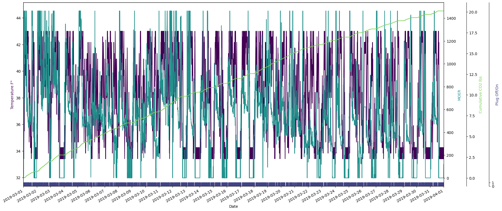

# Smart Fridge Project

expected stdout:
```
total associated CO2: 20.122 lbs
total fridge run time: 10 days, 8:00:00
```



Estimated time spent (not including research time): ~10 hours

## Run with Python 3.6

```
pip install -r requirements.txt
cd src
python refrigerator_sim.py
```

## Run with Docker

```
docker build -t smart-fridge .
docker run -v /my/local/output/dir:/root/output smart-fridge
```

## Model Description

For each five minute interval `t`, the constraints
```
fridge_on(t) ∈ [0,1]
33 <= fridge_temp(t) <= 43
fridge_temp(t+1) = fridge_temp(t) + 5/12 - (10/12 * fridge_on(t))
fridge_temp(0) = 33
```
and objective function
```
[moer(t), ..., moer(t+n)]^T * [fridge_on(t), ..., fridge_on(t+n)]
```
are converted into matrix form and solved with a linear programming model.

The model's action for the next five minute interval, `fridge_on(t)`, is rounded to 1 or 0 and used to turn the fridge on/off. While the simulation behaves well without this rounding, the discontinuous approch felt more practical and realistice given the project description. 


## Future Work 
If I continued to work on this project I would:
* move model and fridge parameters to a config file
  * would lead to a cleaner api
* add more tests
* extend the forecast with a linear trend rather than a global average
* add a Mixed-Integer Linear Programming model with [this repository](https://github.com/coin-or/python-mip)
* add more docstrings and [sphinx documentation](https://www.sphinx-doc.org/en/master/)
* add features to help compare models' performance
